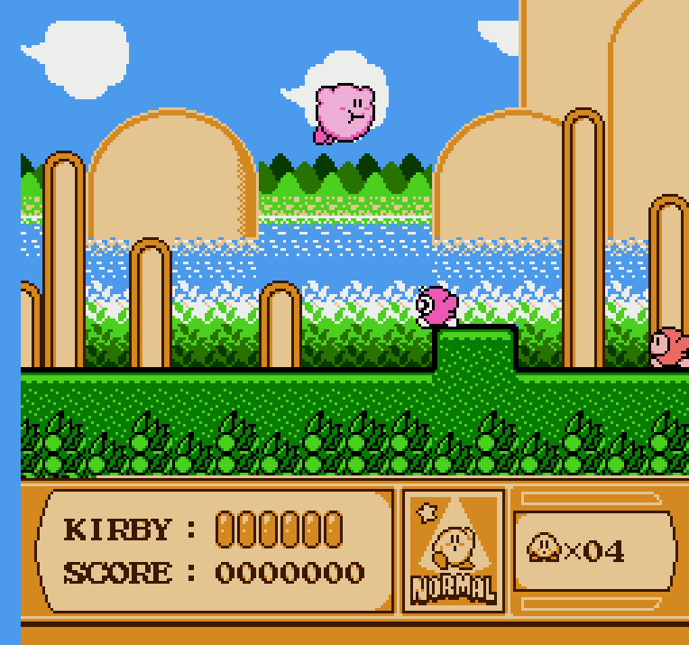
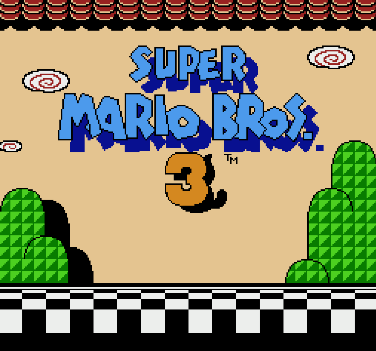

# NES.cpp

NES.cpp - простой и легковесный эмулятор с поддержкой модульности мапперов

## Скриншоты




## Сборка
Зависимости для сборки:
* LuaJit
* gcc

**Linux/MacOS:**
```bash
git clone https://github.com/Noxikly/NES.cpp
cd NES.cpp
make -j
```

**Windows:**
Для начала установите MSYS2 и соответствующие зависимости для проекта
```bash
git clone https://github.com/Noxikly/NES.cpp
cd NES.cpp
make nes_win -j
```