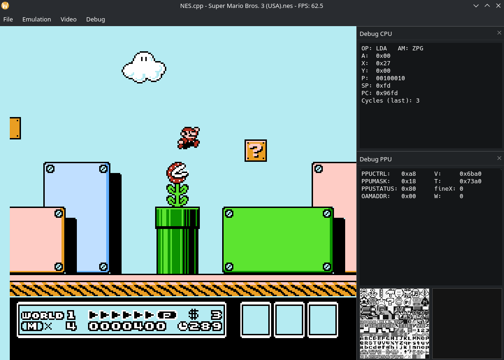

# NES.cpp

NES.cpp - простой и легковесный эмулятор с поддержкой модульности мапперов

## Скриншоты

## Сборка
Руководство по сборке:
* Для [Windows](docs/compile/build_windows.md)
* Для [Linux](docs/compile/build_linux.md)
* Для [MacOS](docs/compile/build_macos.md)